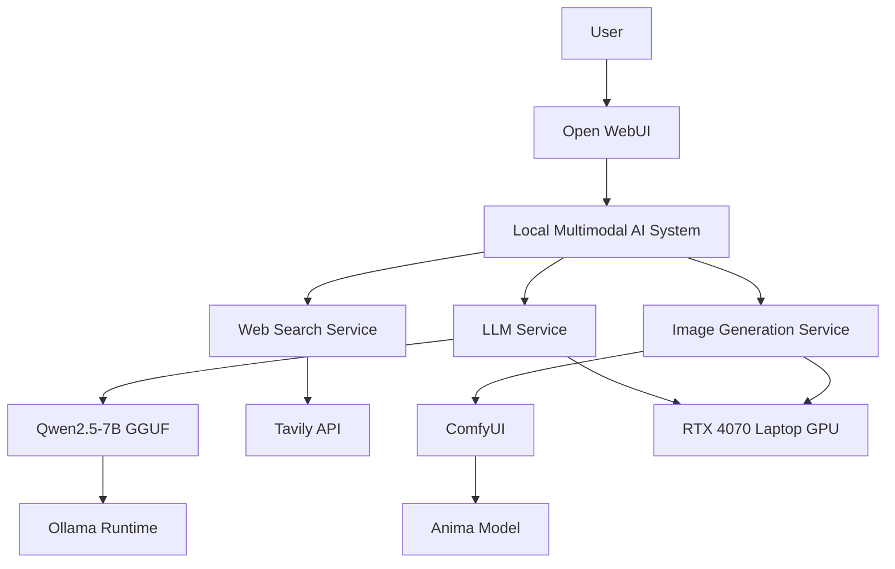

# Local Multimodal AI Chat Assistant with Anima Anime Image Generation

A fully local, privacy-focused multimodal AI system integrating a large language model, real-time web search, and anime-style image generation.

The system supports:

- Chinese/English conversational AI powered by Qwen2.5-7B (GGUF)
- Real-time web search via Tavily API
- Anime-style text-to-image generation using the Anima model through ComfyUI

The project demonstrates local LLM deployment, multimodal integration, Docker orchestration, and custom image generation workflows.

[中文文档 🇨🇳](README_ZH.md)

---

## Screenshots

## System Architecture

graph TD
    A[用户] -->|提问| B[Open WebUI 界面]
    B --> C[本地多模态 AI 系统]
    C --> D[Qwen2.5 对话模块]
    C --> E[Tavily 实时搜索]
    C --> F[ComfyUI 图像生成]
    F --> G[Anima 动漫模型]
    F --> H[文本编码器 + VAE]
    D -->|回复| B
    E -->|搜索结果| B
    G -->|动漫图像| B
    subgraph "本地硬件"
        I[RTX 4070 GPU]
    end
    C --> I
## Tech Stack

- LLM: Qwen2.5-7B-Instruct (GGUF quantized)
- Image Generation: Anima anime-style Stable Diffusion model via ComfyUI
- UI & Backend: Open WebUI (Docker)
- Web Search: Tavily API
- Containerization: Docker + Docker Compose
- Hardware Tested: RTX 4070 Laptop (8GB VRAM)

---

## Quick Start (Conceptual)

1. Install Docker and Ollama.
2. Pull the LLM:
   ollama pull qwen2.5
3. Clone this repository and copy the example config:
   cp docker-compose.example.yml docker-compose.yml
4. Start services:
   docker compose up -d
5. Import the workflow in ComfyUI:
   workflows/anima_workflow.json
