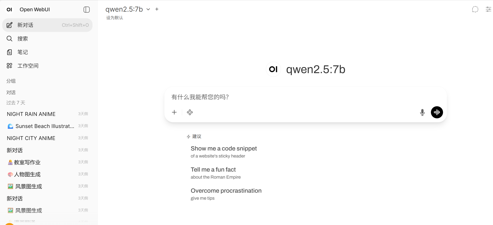
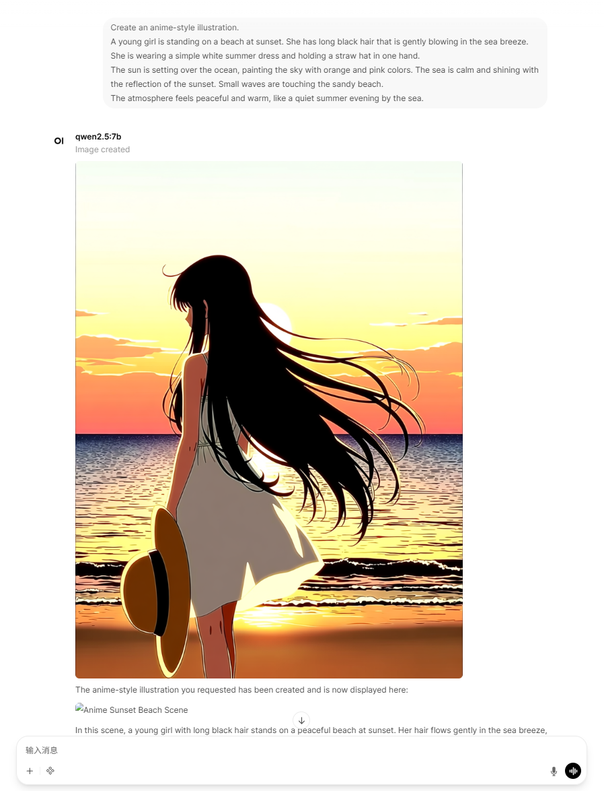
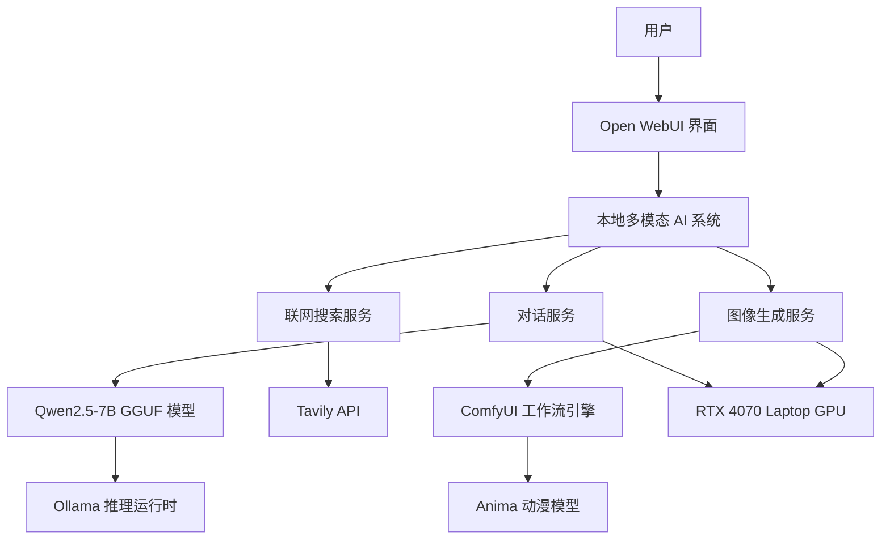

# 本地多模态 AI 聊天助手（支持 Anima 动漫图像生成）

一个完全本地运行、注重隐私的个人 AI 系统，支持：
- 高质量中英文对话（Qwen2.5 7B GGUF 量化版）
- 实时联网搜索（Tavily API）
- 动漫/非写实风格文生图（Anima 模型，通过 ComfyUI 实现）

本项目作为一个 AIGC 方向的技术作品集示例，展示了本地大模型部署、多模态 AI 集成、Docker 容器化编排，以及自定义动漫风格图像生成工作流。

[English README 🇬🇧](README.md)

## 项目截图

  
  
## 系统架构



## 技术栈

- 大语言模型：Qwen2.5-7B-Instruct（GGUF 量化）
- 图像生成：Anima（2B 参数动漫/非写实模型，safetensors 格式，ComfyUI 驱动）
- 用户界面 & 后端：Open WebUI（Docker 部署）
- 联网搜索：Tavily API
- 容器化：Docker + docker-compose
- 测试硬件：RTX 4070 Laptop（8GB 显存）

## 快速开始（Quick Start）

### 1. 环境准备

请先确保已安装以下软件：

- Docker
- Docker Compose
- Ollama
- NVIDIA GPU（推荐）

### 2. 拉取大语言模型

安装并启动 Ollama 后，拉取 Qwen 模型：

```bash
ollama pull qwen2.5
```

### 3. 克隆项目

```bash
git clone https://github.com/your-username/your-repo-name.git
cd your-repo-name
```

### 4. 配置环境

复制配置模板并根据需要修改：

```bash
cp docker-compose.example.yml docker-compose.yml
```

如需使用联网搜索，请在配置文件中填写 **Tavily API Key**。

### 5. 启动服务

```bash
docker compose up -d
```

### 6. 导入 ComfyUI 工作流

打开 ComfyUI，导入项目中的工作流文件：

```
workflows/anima_workflow.json
```

### 7. 访问 Web 界面

启动完成后，在浏览器打开：

```
http://localhost:3000
```

即可进入 Open WebUI，与本地大模型对话或生成动漫风格图片。
